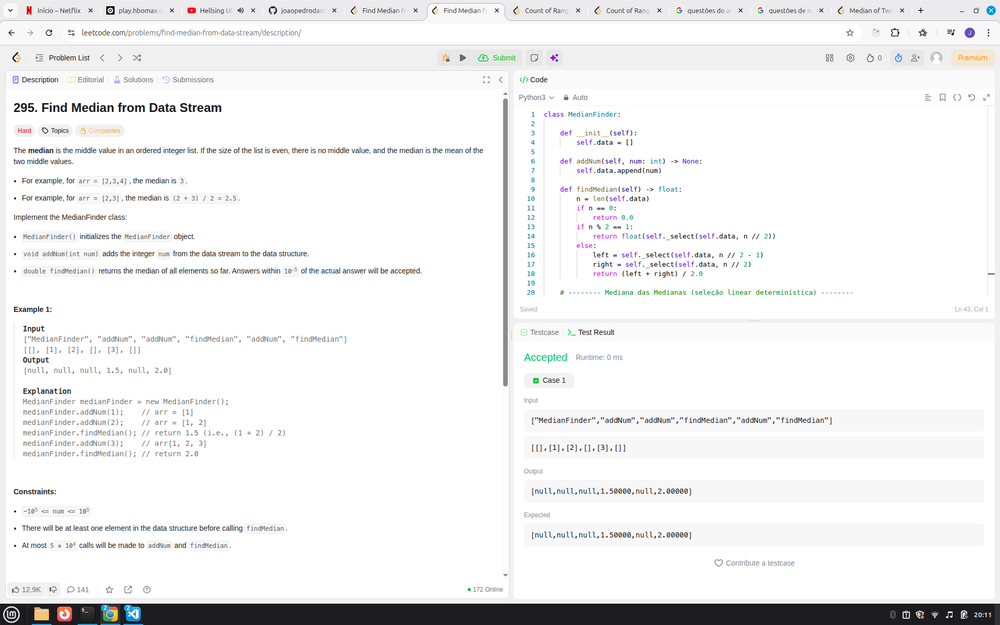
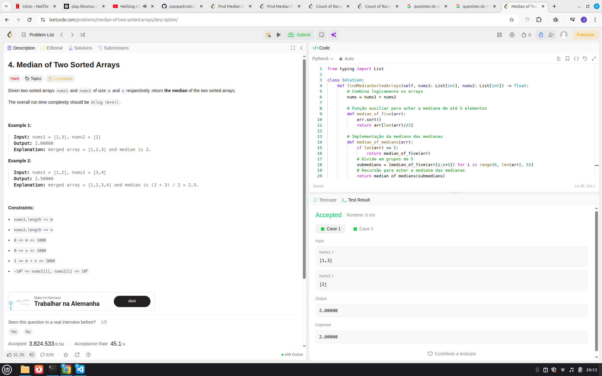
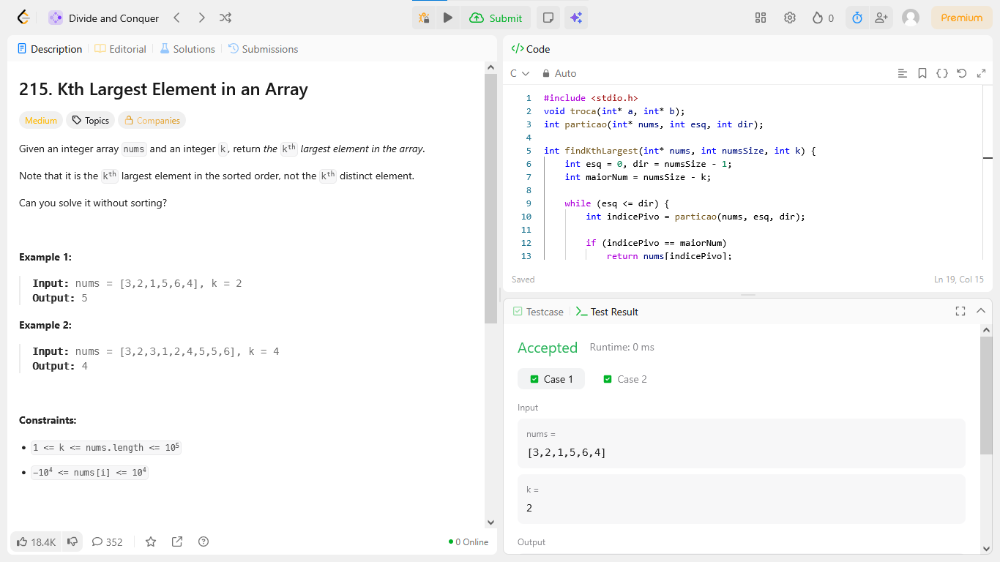
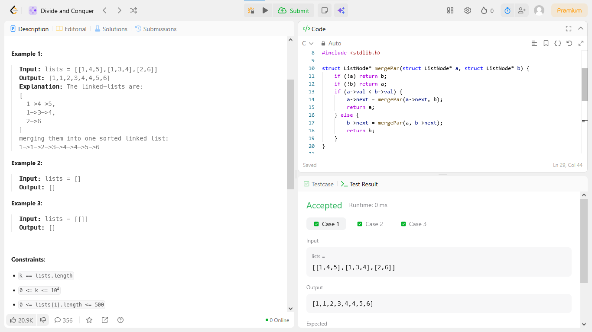

# Dividir e Conquistar

**Número da Lista**: 41<br>
**Conteúdo da Disciplina**: Dividir e conquistar<br>

## Alunos
|Matrícula | Aluno |
| -- | -- |
|190128160  |  Guilherme Maciel de Meneses |
| 211031074  |  João Pedro da Silva Rodrigues|

## Sobre 
### Questões Medias
| Título | Responsável | 
| -- | -- | 
| 215. Kth Largest Element in an Array | Guilherme Maciel | 

### Questões Difíceis
| Título | Responsável | 
| -- | -- | 
| 23. Merge k Sorted Lists | Guilherme Maciel | 
| 295. Find Median from Data Stream | João Pedro | 
| 4. Median of Two Sorted Arrays | João Pedro | 


## Screenshots

### [(295. Find Median from Data Stream)](https://leetcode.com/problems/find-median-from-data-stream/description/)



### [(4. Median of Two Sorted Arrays)](https://leetcode.com/problems/median-of-two-sorted-arrays/description/)

 

### [( 215. Kth Largest Element in an Array)](https://leetcode.com/problems/kth-largest-element-in-an-array/?envType=problem-list-v2&envId=divide-and-conquer)
 

### [( 23. Merge k Sorted Lists)](leetcode.com/problems/merge-k-sorted-lists/description/?envType=problem-list-v2&envId=divide-and-conquer)
 


## Guia de execução

### Questão 215

rode o C:     Guilherme_Maciel/Kth_Largest_Element_in_an_Array.c 

```
Input: nums = [3,2,1,5,6,4], k = 2
Output: 5


```
### Questão 23

rode o C:    Guilherme_Maciel/23. Merge k Sorted Lists

```
Input: lists = [[1,4,5],[1,3,4],[2,6]]
Output: [1,1,2,3,4,4,5,6]
Explanation: The linked-lists are:
[
  1->4->5,
  1->3->4,
  2->6
]
merging them into one sorted linked list:
1->1->2->3->4->4->5->6


```

### Questão 295. Find Median from Data Stream

rode o Python: Joao_Pedro/295.py

```
Input
["MedianFinder", "addNum", "addNum", "findMedian", "addNum", "findMedian"]
[[], [1], [2], [], [3], []]
Output
[null, null, null, 1.5, null, 2.0]


```

### Questão 4. Median of Two Sorted Arrays

rode o Python: Joao_Pedro/4.py

```
Input: nums1 = [1,3], nums2 = [2]
Output: 2.00000
Explanation: merged array = [1,2,3] and median is 2.

```
    
    
## Instalação 
<p>Compilador C instalado, Python instalado </p>


**Linguagem**: C e Python <br>


